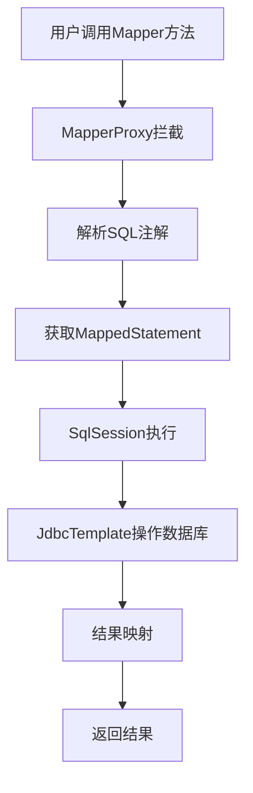

# Mini MyBatis 使用指南

## 🎯 快速体验

### 1. 构建项目
```bash
# 构建Mini MyBatis Starter
cd mybatis
mvn clean install

# 构建并运行示例项目
cd example
mvn clean compile
mvn spring-boot:run
```

### 2. 访问应用
启动后访问以下URL：

- **应用首页**: http://localhost:8080
- **H2数据库控制台**: http://localhost:8080/h2-console
  - JDBC URL: `jdbc:h2:mem:testdb`
  - 用户名: `sa`
  - 密码: 空

### 3. API测试
```bash
# 获取所有用户
curl http://localhost:8080/api/users

# 获取指定用户
curl http://localhost:8080/api/users/1

# 搜索用户
curl "http://localhost:8080/api/users/search?name=张"

# 年龄范围查询
curl "http://localhost:8080/api/users/age-range?minAge=25&maxAge=30"

# 创建用户
curl -X POST http://localhost:8080/api/users \
  -H "Content-Type: application/json" \
  -d '{"name":"新用户","email":"new@example.com","age":28}'

# 更新用户
curl -X PUT http://localhost:8080/api/users/1 \
  -H "Content-Type: application/json" \
  -d '{"name":"更新用户","email":"updated@example.com","age":30}'

# 删除用户
curl -X DELETE http://localhost:8080/api/users/1

# 获取统计信息
curl http://localhost:8080/api/users/stats
```

## 🔧 核心原理演示

### 1. 动态代理工作原理

```java
// 当你调用这个方法时：
User user = userMapper.findById(1L);

// 实际执行过程：
// 1. MapperProxy拦截方法调用
// 2. 解析@Select注解获取SQL
// 3. 构造MappedStatement
// 4. SqlSession执行SQL
// 5. JdbcTemplate执行数据库操作
// 6. 结果映射为User对象返回
```

### 2. 关键组件协作流程



### 3. 配置管理机制

```java
// Spring Boot启动时：
// 1. MyBatisAutoConfiguration自动配置
// 2. 创建Configuration对象
// 3. 创建SqlSessionFactory
// 4. MapperScanner扫描Mapper接口
// 5. 注册MapperProxyFactory
// 6. 创建代理对象注入Spring容器
```

## 🎓 学习重点

### 1. 理解动态代理
- 观察`MapperProxy.invoke()`方法的实现
- 理解如何将接口方法调用转换为SQL执行
- 掌握Java动态代理的应用场景

### 2. 掌握SQL映射
- 理解`@Select`、`@Insert`等注解的作用
- 学习`MappedStatement`如何封装SQL信息
- 掌握参数传递和结果映射机制

### 3. 熟悉会话管理
- 理解`SqlSession`的生命周期
- 掌握`SqlSessionFactory`的工厂模式应用
- 学习数据库连接和事务管理

### 4. 掌握自动配置
- 理解Spring Boot Starter的工作原理
- 学习`@EnableAutoConfiguration`的机制
- 掌握Bean的自动注册和依赖注入

## 🔍 调试技巧

### 1. 开启调试日志
```yaml
logging:
  level:
    com.example.mybatis: DEBUG
    org.springframework.jdbc: DEBUG
```

### 2. 断点调试关键位置
- `MapperProxy.invoke()` - 动态代理入口
- `DefaultSqlSession.selectList()` - SQL执行
- `MapperScanner.registerMapper()` - Mapper注册

### 3. 查看代理对象
```java
@Test
public void testProxy() {
    System.out.println("Mapper类型: " + userMapper.getClass());
    System.out.println("是否为代理: " + Proxy.isProxyClass(userMapper.getClass()));
}
```

## 🚀 扩展实验

### 1. 添加新的SQL注解
```java
@Documented
@Retention(RetentionPolicy.RUNTIME)
@Target(ElementType.METHOD)
public @interface Count {
    String value();
}
```

### 2. 实现简单的缓存机制
```java
public class CacheableSqlSession implements SqlSession {
    private final Map<String, Object> cache = new HashMap<>();
    
    @Override
    public <T> T selectOne(String statement, Object parameter) {
        String key = statement + ":" + parameter;
        if (cache.containsKey(key)) {
            return (T) cache.get(key);
        }
        // 执行查询并缓存结果
        // ...
    }
}
```

### 3. 添加SQL监控
```java
public class MonitoringSqlSession implements SqlSession {
    private final SqlSession delegate;
    private final SqlMetrics metrics;
    
    @Override
    public <T> T selectOne(String statement, Object parameter) {
        long startTime = System.currentTimeMillis();
        try {
            return delegate.selectOne(statement, parameter);
        } finally {
            metrics.record(statement, System.currentTimeMillis() - startTime);
        }
    }
}
```

## 📚 进阶学习

### 1. 对比真实MyBatis
- 研究MyBatis源码中的相同组件
- 理解复杂参数处理机制
- 学习动态SQL的实现原理

### 2. 深入Spring Boot
- 学习更多自动配置原理
- 掌握条件装配机制
- 理解Bean的生命周期管理

### 3. 扩展功能实现
- 实现一级/二级缓存
- 添加插件机制
- 支持动态SQL标签

这个Mini MyBatis虽然简化，但完整体现了MyBatis的核心设计理念，是学习框架原理的绝佳材料！ 